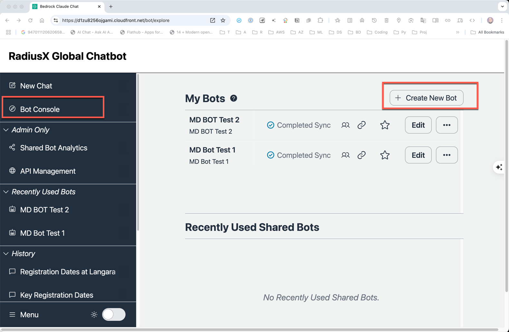
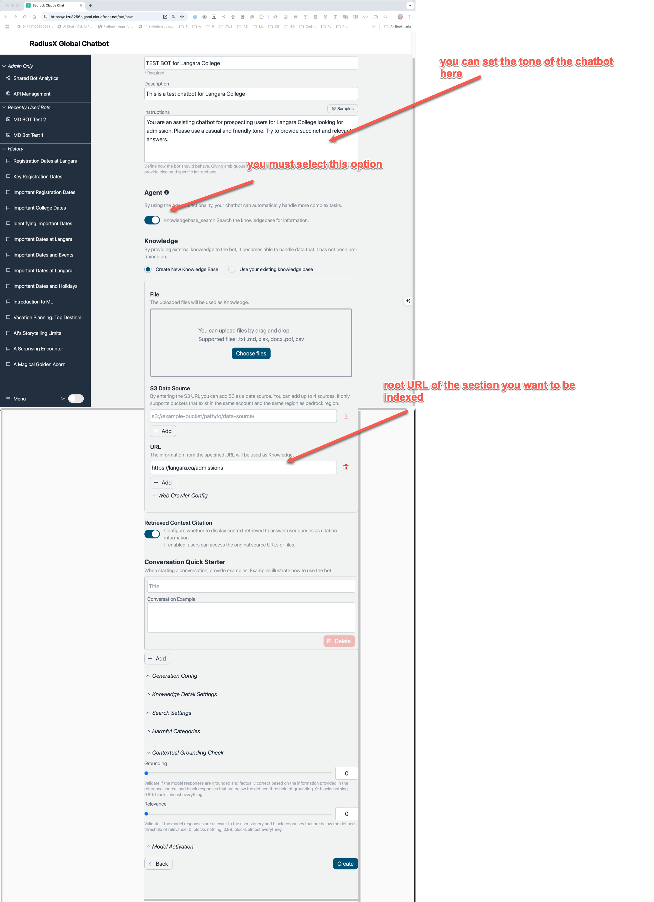
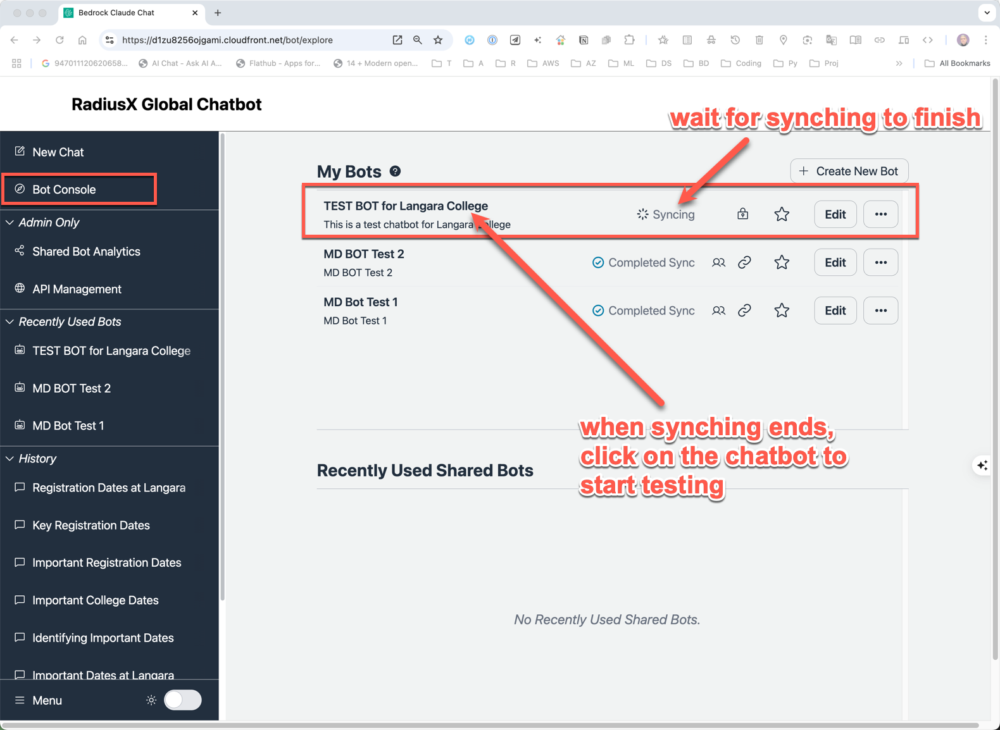
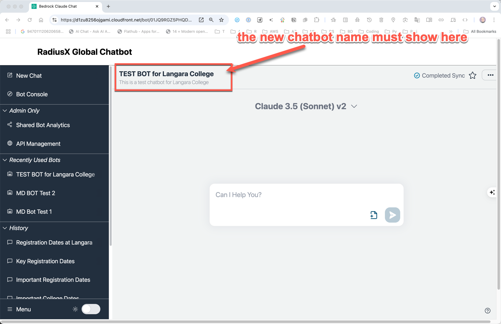
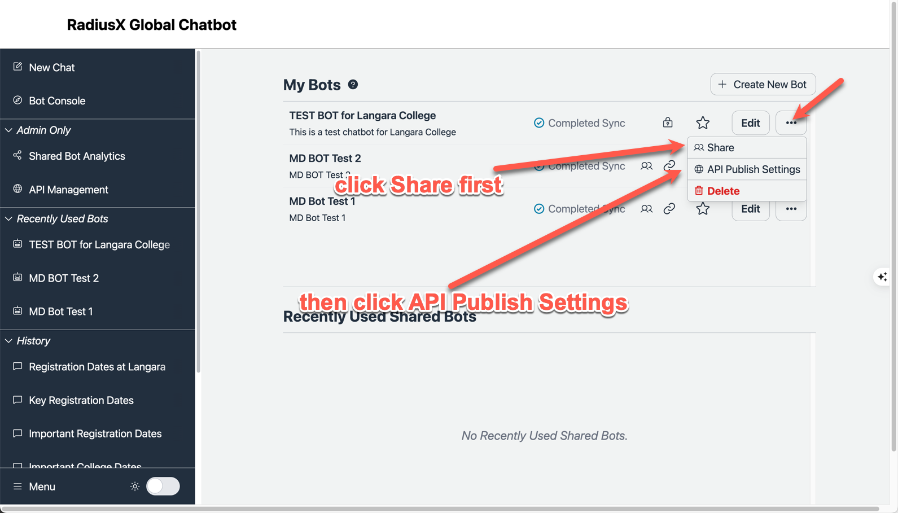
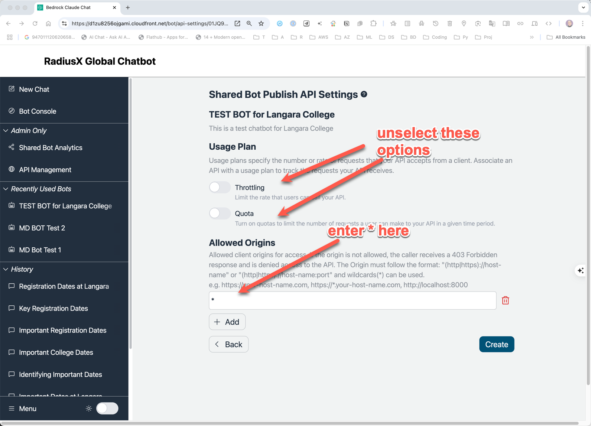
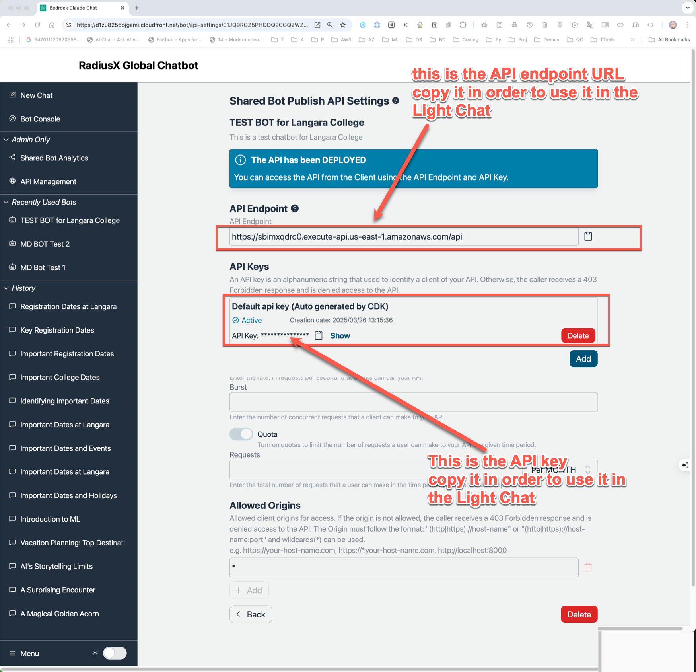
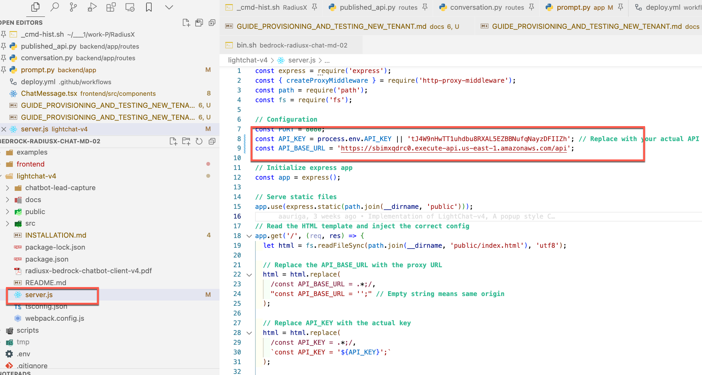
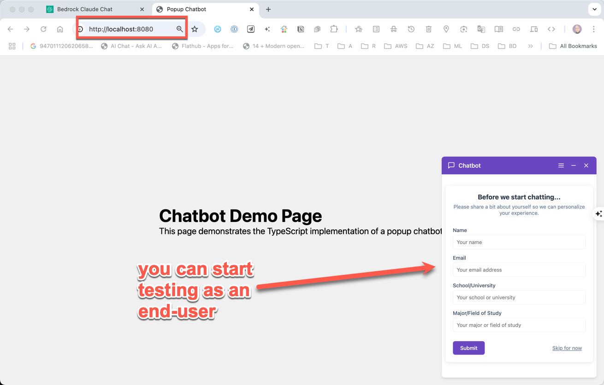

# Guide to Provisioning and Testing a New Tenant

This document outlines the steps required to provision a new tenant.

## Prerequisites

- Administrative access to the AWS Console.
- Membership in the Admin group within Cognito. This can be configured in the AWS Console by navigating to the Cognito user pool and adding the user to the Admin Group.
- A URL or specific information regarding the tenant's location and documents pertinent to the tenant.
- A local clone of the RadiusX repository to facilitate the launch and testing of the light chat locally.

## Main Steps for Creating a New Tenant

1. Create a new ChatBot and configure its Knowledgebase.
2. Test the ChatBot within the main application by selecting the newly created chatbot.
3. Share and create an API Endpoint for the new tenant's chatbot.
   1. Extract the API endpoint URL and authentication key.
4. Configure the Light Chat to utilize the newly created API endpoint and test the chatbot locally.
   1. Set the URL endpoint in the Light Chat settings.
   2. Set the authentication key in the Light Chat settings.

## Detailed Steps

### 1. Create a New ChatBot and Configure its Knowledgebase

- Navigate to the **Bot Console** page within the Admin Console.
- Click the **Create New Bot** button.
- Enter the necessary information to create a new ChatBot.
- Allow time for the Knowledgebase to sync and index the documents. This process may take from a few minutes to several hours, depending on the size of the sites and documents.
- Click **Create**.
- Wait for the Knowledgebase to complete syncing and indexing.

  

  

### 2. Test the ChatBot in the Main Application by Selecting the New Chatbot

- Navigate to the **Bot Console** page within the Admin Console.
- Select the newly created chatbot.
- Engage in a conversation with the chatbot to ensure it functions as expected.





### 3. Share and Create an API Endpoint for the New Tenant's Chatbot

- Navigate to the **Bot Console** page within the Admin Console.
- Select the newly created chatbot.
- Click the **Share** button.
- Click the **Create API Endpoint** button.
- Enter the necessary information to create an API Endpoint.
- Click the **Create** button.







### 4. Configure the Light Chat to Use the Newly Created API Endpoint

- Clone the RadiusX repository.
- Set the API endpoint and authentication key in the Light Chat settings. Refer to the [Light Chat README](https://github.com/PREDICTif/radiusx-bedrock-chatbot/blob/main/lightchat-v4/README.md) for further information.



- Launch the Light Chat locally to test the new chatbot.

```bash
git clone https://github.com/PREDICTif/radiusx-bedrock-chatbot

# Navigate to the `lightchat-v4` directory.

cd radiusx-bedrock-chatbot/lightchat-v4

# Install the dependencies.

npm install

# Launch the Light Chat.

npm run dev
```

- You can now test the new chatbot locally using the new API endpoint.
- **IMPORTANT:** In order to avoid a conflict with the user being part of the Admin group in Cognite, you will have to launch the Light Chat in an Incognito browser window.


