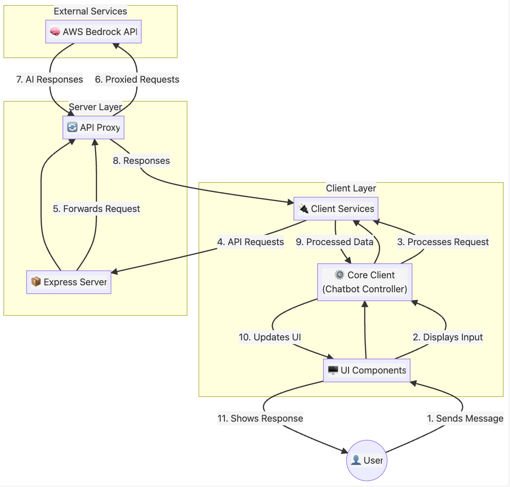

# LightChat v4 Architecture Diagram

## Simplified Architecture Overview

### User

- Interacts with the chatbot through the user interface
- Sends messages and receives responses

### Client Layer

- **UI Components**: User interface elements that display the chat and capture input
- **Core Client**: Main controller that manages the application state and orchestrates components
- **Client Services**: Handles API communication and processes data

### Server Layer

- **Express Server**: Serves the application and handles HTTP requests
- **API Proxy**: Securely forwards requests to external services with proper authentication

### External Services

- **AWS Bedrock API**: AI service that generates intelligent chat responses

### Data Flow

1. User sends a message through the UI
2. UI displays the input and passes it to the Core Client
3. Core Client processes the request and sends it to Client Services
4. Client Services format the request and send it to the Express Server
5. Express Server forwards the request to the API Proxy
6. API Proxy sends the authenticated request to AWS Bedrock API
7. AWS Bedrock API generates a response and returns it
8. The response flows back through the Proxy to the Server
9. Client Services receive and process the response data
10. Core Client updates the application state
11. UI displays the response to the User
